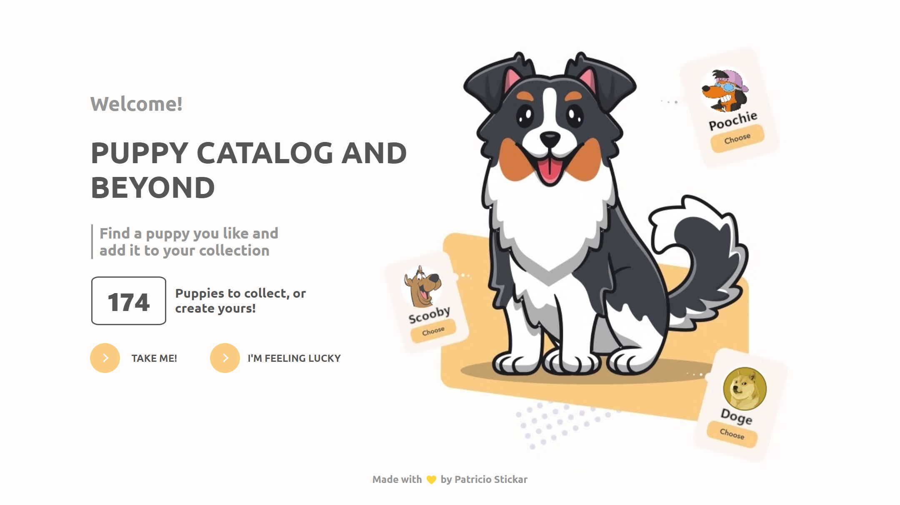
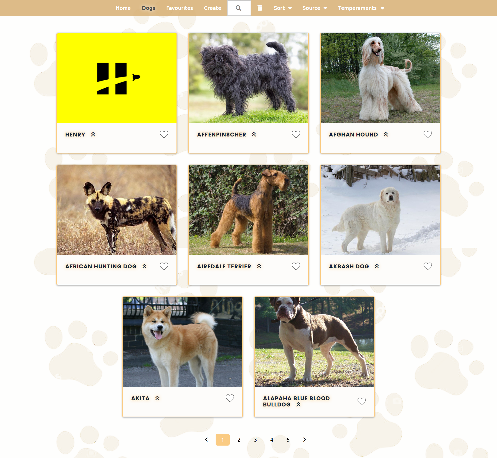
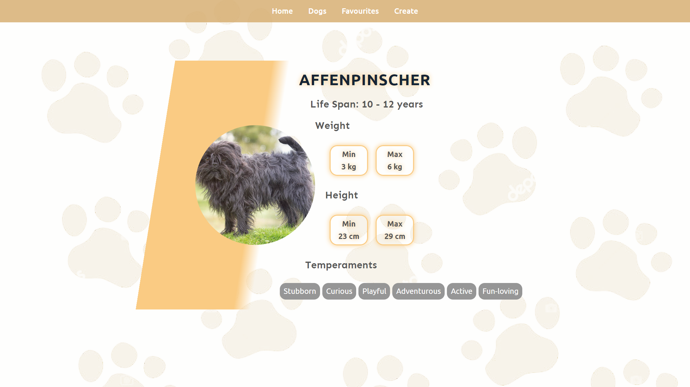
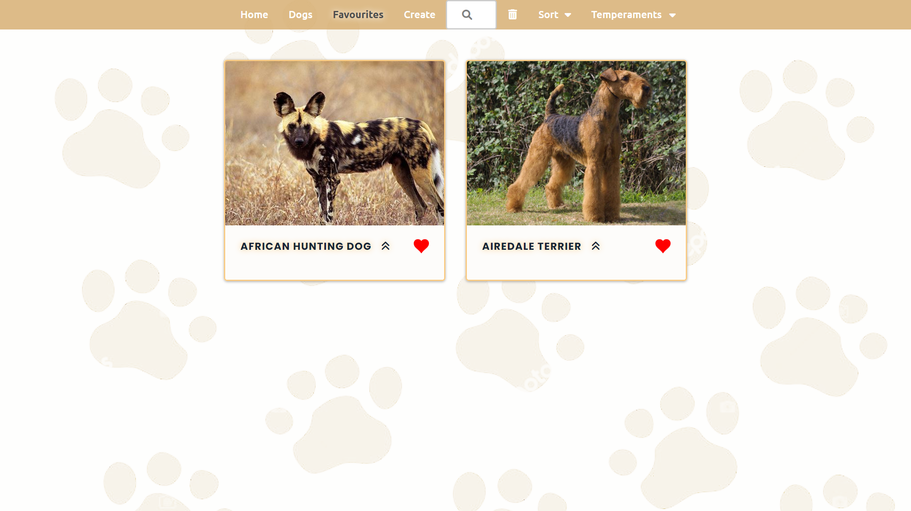
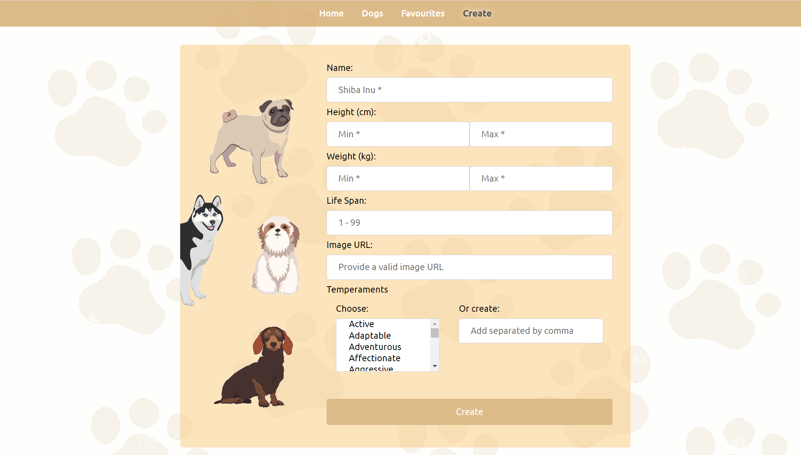

    

# Individual Project - The Puppy Catalog

## General Objectives

- Build a SPA using React, Redux, Node and Sequelize.
- Affirm and connect the concepts learned in the bootcamp.
- Learn best practices.
- Learn and practice the GIT workflow.
- Use and practice testing.

## Minimum requirements

Create an application in which different breeds of dog can be seen along with relevant information about them using the external API [the dog api](https://www.thedogapi.com/) and from it you can, among other things:

- Search dogs by name
- Sort by name, weight or temperament
- Filter by source (external API or stored in DB)
- Add new dogs
- Show dog breed details on a separate page

## Constraints

To not use any other external library to implement styling and functionalities

### Custom implemented

- Pagination
- Form validation
- Alerts

## Extras

- Favourites page
- Deployment

## Screen Captures

